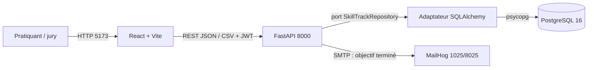

# D — Architecture, décisions et réutilisation

## 1. Vue de contexte



MailHog reçoit en développement une notification lorsqu'un objectif passe de non terminé à terminé. L'envoi est placé en tâche d'arrière-plan et une panne SMTP ne doit pas annuler la modification métier. Le profil de production n'inclut volontairement pas MailHog.

## 2. Conteneurs et responsabilités

| Élément | Responsabilité | Interfaces | Preuve |
|---|---|---|---|
| Frontend | navigation, formulaires, feedback, téléchargement | API HTTP | `frontend/src/main.jsx`, `GoalsPage.jsx`, `api.js` |
| API | contrats, auth, validation, orchestration | `/docs`, routes REST | `backend/app/main.py` |
| Services | création/mise à jour, représentation, agrégats | fonctions Python | `backend/app/services.py` |
| Port de stockage | contrat indépendant de la technologie de persistance | protocole Python injecté | `backend/app/repositories.py:13-50` |
| Adaptateur PostgreSQL | requêtes SQLAlchemy, filtrage propriétaire et transactions | implémentation du port | `backend/app/repositories.py:53-137` |
| Échange | parsing/sérialisation CSV et JSON versionnés | fonctions Python | `backend/app/data_exchange.py` |
| Notifications | message de fin d'objectif et repli non bloquant | SMTP | `backend/app/notifications.py` |
| ORM | entités, relations, cascade, index | SQLAlchemy | `backend/app/models.py` |
| Migrations | évolution canonique, contraintes et trigger | Alembic | `backend/app/alembic/versions/` |
| PostgreSQL | persistance relationnelle | TCP 5432 | `docker-compose.yml`, `infra/postgres/001_init.sql` |
| CI | lint, typage, tests, build | GitHub Actions | `.github/workflows/ci.yml` |

Le backend reste un monolithe compact, mais les accès métier ne portent plus de requêtes SQLAlchemy : routes, dépendance d'authentification, services et échanges utilisent le port `SkillTrackRepository`; seul l'adaptateur connaît les requêtes et PostgreSQL. Le dashboard est testé avec un dépôt substitué (`test_dashboard_business_logic_accepts_a_substituted_storage_port`) et l'adaptateur réel est couvert par les tests d'intégration PostgreSQL. Le peuplement initial de démonstration conserve une écriture SQLAlchemy interne au cycle de démarrage ; ce n'est pas une dépendance d'un service utilisateur.

## 3. Flux d'une requête protégée

```text
Navigation → api.js ajoute Authorization: Bearer <JWT>
→ current_user décode le sujet et charge User
→ route valide le corps Pydantic
→ port repository injecté, adaptateur SQLAlchemy filtre id + owner_id
→ transaction PostgreSQL
→ schéma/réponse JSON → interface
```

Références : `frontend/src/api.js`, `backend/app/deps.py`, `backend/app/repositories.py` et `backend/app/main.py`.

## 4. Bibliothèque de fonctions métier

| Fonction | Contrat | Réutilisateurs | Limites |
|---|---|---|---|
| `workout_volume(workout)` | agrège les contributions des exercices | détail séance et dashboard | formule métier à figer avec le commanditaire |
| `make_workout_out(workout)` | sérialise séance + exercices + volume | liste, détail, création, modification | dictionnaire lié au modèle courant |
| `create_workout(repository,user,data)` | construit l'agrégat et commit via le port | API | transaction appelée par agrégat |
| `update_workout(repository,w,data)` | remplace champs et exercices via le port | API PUT | stratégie « remplacement complet » |
| `dashboard(repository,user)` | produit indicateurs et séries 8 semaines | route `/dashboard`, test avec dépôt substitué | agrégats en mémoire, à surveiller en volume |

Preuve : `backend/app/services.py`.

## 5. ADR-001 — Monolithe compact pour le MVP

- **Statut :** accepté le 19/08/2026, à réexaminer avant production.
- **Contexte :** démonstrateur à lancer localement, équipe individuelle, besoin de lecture rapide.
- **Décision :** une API FastAPI, un frontend et une BDD ; pas de microservices.
- **Conséquences positives :** déploiement simple, peu de latence réseau, parcours auditable.
- **Dette :** `main.py` concentre encore les routes et leur orchestration ; séparer les routeurs par domaine si le périmètre croît.

## 6. ADR-002 — PostgreSQL + SQLAlchemy

- **Décision :** PostgreSQL 16 est le stockage de référence ; SQLAlchemy fournit l'ORM.
- **Motifs :** relations, clés étrangères, index, transactions, environnement CI disponible.
- **Alternative écartée :** stockage navigateur/SQLite, insuffisant pour prouver une BDD tierce et les contraintes multi-utilisateurs.
- **Découplage :** `SkillTrackRepository` définit le port et `SqlAlchemySkillTrackRepository` l'adaptateur ; les services métier sont substituables sans modifier leurs algorithmes.
- **Limite :** un autre stockage demanderait un nouvel adaptateur et des tests contractuels supplémentaires ; PostgreSQL demeure l'unique adaptateur livré.

## 7. ADR-003 — Stratégie de réutilisation

| Élément | Choix | Motif | Risque/contrôle |
|---|---|---|---|
| FastAPI/Pydantic | réutilisation totale | contrats et OpenAPI éprouvés | `requirements.lock` + tests |
| SQLAlchemy/psycopg | réutilisation totale | abstraction ORM/PostgreSQL | lock Python + tests d'intégration |
| React/Vite/Lucide | réutilisation totale | UI rapide et composants d'icônes | versions exactes + lockfile, mises à jour via revue/audit |
| Règles volume/import | écriture neuve | spécifiques à SkillTrack | tests cas limites |
| MailHog | infrastructure réutilisée | serveur SMTP local pour objectif terminé | développement uniquement, panne non bloquante |
| Architecture initiale | adaptation/réécriture partielle | simplifier la démonstration | dette de modularité documentée |

La décision a été prise dans un contexte individuel. **Une revue collective datée par un pair est requise** pour répondre pleinement à la compétence de décision en équipe/CMMI.

## 8. ADR-004 — MailHog comme service SMTP de développement

- **Décision :** déclencher un e-mail lors du premier passage d'un objectif à terminé.
- **Motifs :** démontrer une intégration hétérogène sans dépendre d'un fournisseur ni envoyer de vraies données.
- **Résilience :** tâche d'arrière-plan, exception SMTP capturée et journalisée sans adresse en clair.
- **Preuve :** `backend/app/main.py:edit_goal`, `backend/app/notifications.py`, test `test_goal_completion_triggers_mailhog_once_without_logging_personal_data`.
- **Limite :** MailHog n'est pas un serveur de production ; un relais réel, le consentement et les règles de conservation seraient à définir.

## 9. Urbanisation cible

SkillTrack est autonome et n'est relié à aucun SI d'entreprise réel. Dans une cible, l'API constitue la façade, PostgreSQL le système maître des entraînements, et CSV/JSON les interfaces d'échange. Les évolutions prévues sont : découpage des routeurs, pagination/requêtes agrégées, observabilité externe, secrets gérés et proxy HTTPS. Le port repository, Alembic et les images production multi-stage sont désormais présents, sans constituer à eux seuls une exploitation publique.
