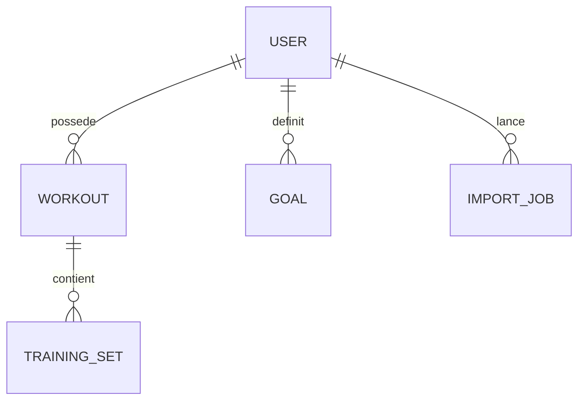

# E — MCD, MPD, dictionnaire et règles de gestion

## 1. Modèle conceptuel

Règles de cardinalité : un utilisateur peut n'avoir aucune séance, aucun objectif et aucun import ; l'interface guide une nouvelle séance vers au moins un exercice, mais le contrat API accepte aussi une séance vide afin de préserver l'import/export de données historiques ; chaque objet métier appartient à exactement un utilisateur ; une ligne d'exercice appartient à exactement une séance.

## 2. Modèle physique simplifié

| Table | Clé primaire | Clés étrangères/index | Données principales |
|---|---|---|---|
| `users` | `id varchar(36)` | `email` unique/indexé | email, display_name, password_hash, created_at |
| `workouts` | `id varchar(36)` | `owner_id → users.id ON DELETE CASCADE`, index | title, date, type, intensity, duration_minutes, notes |
| `training_sets` | `id varchar(36)` | `workout_id → workouts.id ON DELETE CASCADE`, index | exercise, category, set_count, reps, charge, durée, difficulté, assistance, notes |
| `goals` | `id varchar(36)` | `owner_id → users.id ON DELETE CASCADE`, index | skill, cible, valeurs, unité, priorité, statut, échéance |
| `import_jobs` | `id varchar(36)` | `owner_id → users.id ON DELETE CASCADE`, index | filename, lignes importées/rejetées/ignorées, rapport, created_at |

Source de vérité ORM : `backend/app/models.py:21-133`. Le schéma déployé est versionné dans `backend/app/alembic/versions/` et appliqué par `backend/app/migrations.py:run_migrations` lors du cycle de vie FastAPI.

## 3. Dictionnaire métier

| Champ | Type/borne applicative | Sens | Règle |
|---|---|---|---|
| `User.email` | EmailStr, 255 en BDD | identifiant de connexion | unique, non exposé hors propriétaire |
| `Workout.title` | 2..160 caractères | nom de séance | obligatoire |
| `Workout.date` | date ISO | date d'exécution | obligatoire |
| `Workout.intensity` | entier 1..10 | effort global | défaut 6 |
| `Workout.duration_minutes` | entier 1..1440 | durée séance | défaut 60 |
| `TrainingSet.exercise` | 2..160 caractères | mouvement/figure | obligatoire |
| `TrainingSet.category` | texte ≤40 | poussée, tirage, etc. | défaut `autre` |
| `TrainingSet.set_count` | entier 1..50 | séries représentées par la ligne | intervient dans les agrégats |
| `TrainingSet.reps` | entier 0..1000 | répétitions par série | 0 autorisé pour maintien |
| `load_kg` / `assistance_kg` | décimal 0..1000 | charge ajoutée / assistance | jamais négatif |
| `duration_seconds` | entier 0..86400 | temps de maintien | 0 si non applicable |
| `difficulty` | entier 1..10 | difficulté ressentie | obligatoire par défaut 5 |
| `Goal.current_value` | décimal ≥0 | progression actuelle | rapportée à `target_value` |
| `Goal.target_value` | décimal >0 | cible mesurable | empêche division par zéro |
| `Goal.status` | actif/termine/archive | cycle de vie | cohérent avec `is_done` côté UI |
| `ImportJob.report` | texte | erreurs par ligne | vide si aucun rejet |

Bornes : `backend/app/schemas.py:22-77` ; types/relations : `backend/app/models.py`.

## 4. Contraintes et intégrité

- PK UUID textuelles générées par l'application ;
- unicité de l'e-mail ;
- FK avec suppression en cascade pour séances, séries et objectifs ;
- relation ORM `delete-orphan` pour séances/objectifs/séries ;
- filtrage applicatif systématique `owner_id` sur routes protégées ;
- contraintes `CHECK` en base sur intensité, durée, séries, répétitions, charges, objectif et compteurs d'import ;
- trigger PostgreSQL synchronisant `Goal.is_done` et `Goal.status` ;
- bornes Pydantic avant écriture.

La fonction historique `update_updated_at_column()` de `infra/postgres/001_init.sql` n'est pas attachée. En revanche, la révision `20260819_02_goal_consistency.py` crée un **trigger actif** `trg_goals_completion_consistency` qui synchronise `status` et `is_done`, en complément du `CHECK`. Les tests d'intégrité inspectent les contraintes et vérifient la suppression en cascade.

## 5. Règles de gestion

1. RG-01 — toute séance, objectif ou import est créé avec l'identifiant du JWT courant.
2. RG-02 — une ressource absente ou appartenant à un autre utilisateur retourne 404 afin de ne pas divulguer son existence.
3. RG-03 — l'interface conserve au moins une ligne lors de la saisie ; l'API autorise zéro ligne et sérialise ce cas sans erreur.
4. RG-04 — le dashboard n'agrège que les séances et objectifs du propriétaire.
5. RG-05 — l'import regroupe les lignes par couple `(date, title)`.
6. RG-06 — chaque ligne invalide est rejetée et décrite ; les lignes valides restent importables.
7. RG-07 — la suppression du compte doit cascader vers toutes les données rattachées.
8. RG-08 — l'export doit contenir toutes les données du propriétaire, jamais celles d'un tiers.

## 6. Évolution d'un schéma existant

La révision Alembic `20260819_01_canonical_schema.py` détecte les colonnes héritées, ajoute/copie les champs canoniques (`owner_id`, `date`, compteurs d'import), recrée les FK cascade, index et contraintes. `20260819_02_goal_consistency.py` ajoute la cohérence objectif/trigger ; `20260819_03_legacy_user_defaults.py` fournit les défauts serveur requis par les colonnes historiques conservées. Toute migration reste à tester sur sauvegarde restaurée avant une base réelle.
