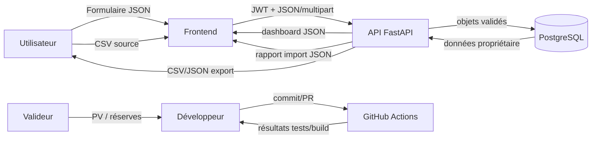

# P — Procédures, réingénierie AS-IS/TO-BE et flux documentaires

## 1. Portée probatoire

La procédure ci-dessous formalise le service utilisateur SkillTrack. Elle constitue un cas pédagogique observable. Le RNCP demande un cas réel d'entreprise : il faudra transposer la même méthode à une situation authentique, anonymisée et validée par le référent. Aucun processus d'entreprise n'est inventé ici.

## 2. Procédure utilisateur TO-BE

| Étape | Acteur | Entrée | Action/contrôle | Sortie |
|---|---|---|---|---|
| 1 | Utilisateur | identifiants | connexion ; message si refus | JWT/session |
| 2 | Utilisateur | séance réelle | saisie champs et au moins un exercice | requête JSON validée |
| 3 | API | JWT + JSON | identité, bornes, transaction | séance PostgreSQL |
| 4 | Utilisateur | objectifs | crée et actualise valeur/statut | objectif mesurable |
| 5 | API | séances/objectifs | calcule volume et semaines du propriétaire | dashboard |
| 6 | Utilisateur | CSV externe | contrôle format, lecture du rapport | séances + rapport |
| 7 | Utilisateur | demande de portabilité | télécharge CSV/JSON | fichiers locaux |
| 8 | Utilisateur | demande d'effacement | confirme action destructive | compte et enfants supprimés |

Contrôles de management proposés : DoD avant livraison, CI verte, recette, sauvegarde avant changement de schéma, revue des risques et PV de validation.

## 3. AS-IS / TO-BE

| Dimension | AS-IS : carnet/tableur dispersé (hypothèse à valider) | TO-BE : SkillTrack | Indicateur à mesurer |
|---|---|---|---|
| Saisie | format libre | champs et bornes explicites | erreurs de saisie/10 séances |
| Calcul | formules manuelles | agrégats automatiques | temps de bilan hebdomadaire |
| Objectifs | texte non normalisé | valeur/cible/unité/statut | objectifs mesurables/total |
| Historique | fichiers multiples | base propriétaire | temps pour retrouver une séance |
| Échange | copier-coller | import + export CSV/JSON | lignes rejetées et temps d'import |
| Droits | sécurité du fichier local | JWT, owner_id, export/effacement | tests d'isolation réussis |

Les bénéfices restent des hypothèses tant qu'un utilisateur n'a pas fourni les mesures avant/après.

## 4. Circulation des données et documents

| Document/donnée | Producteur | Rubriques/provenance | Destinataire | Contrôle | Conservation |
|---|---|---|---|---|---|
| Formulaire séance | utilisateur via UI | valeurs observées lors de l'entraînement | API/BDD | HTML + Pydantic | vie du compte |
| CSV import | utilisateur/autre outil | mapping `J_import_export.md` | API | taille, UTF-8, colonnes, lignes | fichier non conservé ; rapport en BDD |
| Rapport import | API | numéro et exception de conversion | utilisateur | test invalid CSV | vie du compte |
| Dashboard | API | calcul depuis BDD propriétaire | utilisateur | tests chiffres connus | calcul à la demande |
| Export | API | tables du propriétaire | utilisateur | tests contenu/étanchéité | poste utilisateur |
| PR/CI | développeur/GitHub | diff et contrôles | relecteur | checklist DoD | dépôt Git |
| PV recette | valideur | scénarios, réserves, décision | projet/jury | signature réelle | dossier de preuve |

## 5. Matrice RACI cible

| Activité | Porteur projet | Utilisateur pilote | Pair technique | Référent/commanditaire |
|---|---|---|---|---|
| Besoin/backlog | R | C | I | A à obtenir |
| Développement/tests | R/A | I | C | I |
| Revue architecture/sécurité | R | I | C/A à obtenir | I |
| Recette fonctionnelle | C | R | I | A à obtenir |
| Go/No-Go | R | C | C | A à obtenir |

R = réalise, A = approuve, C = consulté, I = informé. Les rôles « à obtenir » ne sont pas encore des personnes nommées.

## 6. Dossier entreprise à joindre

- contexte et règles de gouvernance réels ;
- procédure AS-IS observée et TO-BE proposée ;
- indicateurs avant/après mesurés ;
- schéma de documents avec acteurs, champs, provenance et conservation ;
- compte rendu d'arbitrage et validation du référent ;
- anonymisation approuvée.
