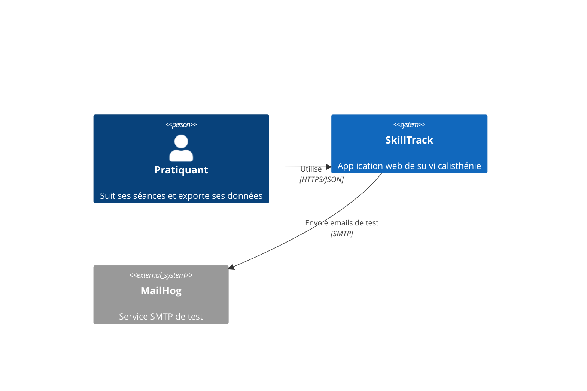
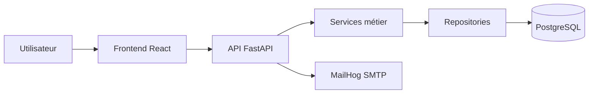

# D1-01 — Architecture SkillTrack

## Contexte

## Conteneurs

## Responsabilités

| Composant | Responsabilité | Tests |
|---|---|---|
| Frontend | Formulaires, dashboard, accessibilité | Vitest, audit RGAA |
| API | Contrats HTTP, auth, validation | TestClient |
| Services | Règles métier | pytest |
| Repositories | Accès données | tests substitution/mémoire |
| PostgreSQL | Contraintes, index, transactions | tests intégrité |
